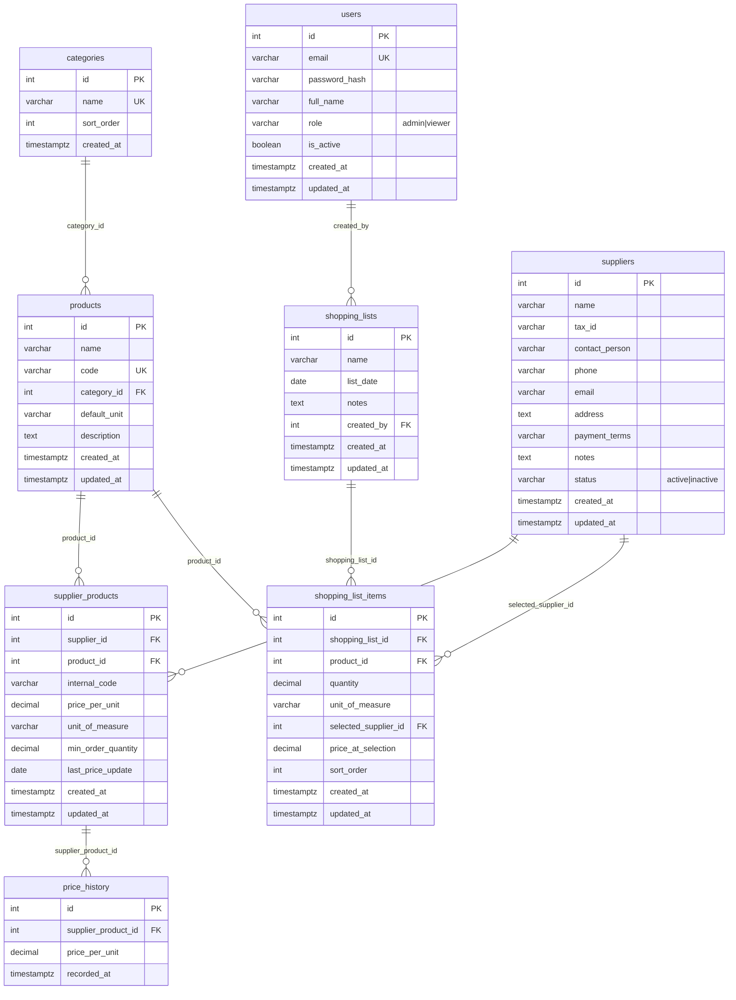

# ERD – מערכת קניין ורשימות קנייה לביכורים

## דיאגרמת קשרים (Entity Relationship Diagram)

---

## תיאור הטבלאות והקשרים

### 1. `users` – משתמשים
- **תפקיד:** הרשאות (קניין = Admin, צפייה בלבד = Viewer).
- **שדות עיקריים:** `email`, `password_hash`, `role`, `full_name`.
- **קשר:** משתמש יוצר רשימות קנייה (`shopping_lists.created_by`).

---

### 2. `suppliers` – ספקים
- **תפקיד:** כרטיס ספק – שם, ח.פ, איש קשר, טלפון, אימייל, כתובת, תנאי תשלום, הערות, סטטוס.
- **קשרים:**
  - **N:M עם `products`** דרך `supplier_products` – ספק מוכר מוצרים רבים, מוצר נמכר אצל ספקים רבים.
  - **1:N עם `shopping_list_items`** – בכל שורה ברשימה יכול להישמר "הספק שנבחר" (`selected_supplier_id`).

---

### 3. `categories` – קטגוריות
- **תפקיד:** קטגוריות מוצרים (ירקות, פירות, יבש, קפוא וכו').
- **קשר:** 1:N עם `products` – לכל מוצר קטגוריה אחת (אופציונלית).

---

### 4. `products` – מוצרים (מאגר כללי)
- **תפקיד:** שם מוצר, קוד, קטגוריה, יחידת מידה, תיאור.
- **קשרים:**
  - **N:M עם `suppliers`** דרך `supplier_products` – **זה הקשר המרכזי**: מוצר אחד → ספקים רבים, מחיר שונה לכל ספק.
  - **1:N עם `shopping_list_items`** – כל שורה ברשימה מתייחסת למוצר אחד.

---

### 5. `supplier_products` – **הלב של המערכת**
- **תפקיד:** טבלת קשר בין ספק למוצר + **מחיר ליחידה**.
- **שדות קריטיים:**
  - `supplier_id`, `product_id` – זיהוי הספק והמוצר.
  - `price_per_unit` – המחיר אצל ספק זה.
  - `internal_code` – קוד מוצר פנימי אצל הספק.
  - `unit_of_measure`, `min_order_quantity`, `last_price_update`.
- **אילוץ:** `UNIQUE(supplier_id, product_id)` – מחיר אחד לכל צמד ספק–מוצר.
- **קשר:** טבלת היסטוריה (אופציונלית) – `price_history` לרישום שינויי מחירים לדוחות.

---

### 6. `shopping_lists` – רשימות קנייה
- **תפקיד:** רשימה אחת – שם, תאריך, הערות, מי יצר.
- **קשר:** 1:N עם `shopping_list_items` – כל רשימה מכילה פריטים רבים.

---

### 7. `shopping_list_items` – פריטים ברשימת קנייה (קריטי לאפיון)
- **תפקיד:** שורה ברשימה – **מוצר, כמות, והספק שנבחר + המחיר בזמן הבחירה**.
- **שדות קריטיים:**
  - `product_id` – איזה מוצר.
  - `quantity`, `unit_of_measure` – כמות ויחידה.
  - **`selected_supplier_id`** – הספק שנבחר (הזול ביותר אוטומטית או בחירה ידנית).
  - **`price_at_selection`** – המחיר שהיה נכון **לאותו רגע** (snapshot), כדי שהרשימה לא תשתנה כשמחירי הספק משתנים.
- **אילוץ:** אם נבחר ספק – חובה גם `price_at_selection` (CHECK constraint).
- **קשרים:** FK ל־`shopping_lists`, `products`, `suppliers`.

---

### 8. `price_history` – היסטוריית מחירים (שלב מתקדם)
- **תפקיד:** דוחות – היסטוריית מחירים לפי מוצר, ספק זול לאורך זמן, חיסכון חודשי.
- **קשר:** N:1 עם `supplier_products` – כל שינוי מחיר (או עדכון ידני) יכול להירשם כאן.

---

## סיכום קשרים מרכזיים

| קשר | הסבר |
|-----|------|
| **מוצר ↔ ספקים** | דרך `supplier_products`: מוצר אחד → ספקים רבים, כל ספק עם מחיר משלו. |
| **רשימת קנייה → פריטים** | כל פריט שומר **מוצר + כמות + ספק נבחר + מחיר בזמן הבחירה**. |
| **תמיכה בעברית** | PostgreSQL עם `UTF-8`; כל שדות הטקסט תומכים בעברית. |

---

## שאילתות שימושיות (רעיונות ל-Backend)

1. **"מי הספק הזול ביותר למוצר X?"**  
   `SELECT supplier_id FROM supplier_products WHERE product_id = :id ORDER BY price_per_unit ASC LIMIT 1`

2. **"כל הספקים שמוכרים מוצר X עם מחירים"**  
   `SELECT s.*, sp.price_per_unit, sp.unit_of_measure FROM supplier_products sp JOIN suppliers s ON s.id = sp.supplier_id WHERE sp.product_id = :id ORDER BY sp.price_per_unit`

3. **"פיצול רשימת קנייה לפי ספקים"**  
   `SELECT selected_supplier_id, SUM(quantity * price_at_selection) FROM shopping_list_items WHERE shopping_list_id = :id GROUP BY selected_supplier_id`

---

*מסמך זה הוא חלק משלב 1 – תכנון הנתונים. הקבצים: `schema.sql`, `ERD.md`.*
